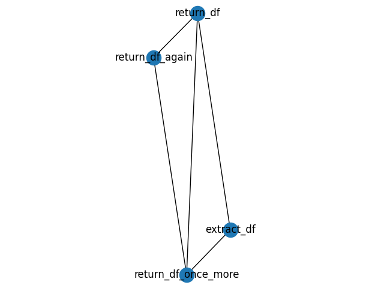

# Spark-Lineage
Spark-Lineage is a tool for data lineage, transformation mapping & business rule dependency for pyspark.

## Simple Example
```python
from spark_lineage.LineageFactory import LineageFactory
lineage = LineageFactory()

spark = SparkSession.builder.appName("spark-lineage").getOrCreate()

@lineage.lineage(description='I create a a new column that is the same as AGE column.')
def return_df(df):
    return df.withColumn(colName = 'df', col = f.col('age'))

@lineage.lineage(is_extractor=True, description='This is a sample extractor, next time try me with a path!')
def extract_df():
    return spark.createDataFrame(["10","11","13"], "string").toDF("age")

@lineage.lineage(description='I am here to check my graphs!')
def return_df_again(df):
    return df.withColumn(colName = 'duf', col = f.col('df'))

@lineage.lineage(description='I am here to check my graphs with more nodes!')
def return_df_once_more(df, df2, df3):
    return df.withColumn(colName = 'kipp', col = f.col('df'))


extracted = extract_df(path=None)
returned = return_df(extracted)
returned_again = return_df_again(returned)
df = return_df_once_more(returned, extracted, returned_again)
print(df.graph())
df.print_graph()
```

### Result



## Parsing from SQL Context
```python
from spark_lineage.LineageFactory import LineageFactory
from spark_lineage.domain.Parser import Parser

lineage = LineageFactory(required_parser=Parser.REQUIRED_SPARK_EXECUTION_PARSER)

spark = SparkSession.builder.appName("spark-lineage").getOrCreate()

df = spark.createDataFrame(["10","11","13"], "string").toDF("age")
df2 = spark.createDataFrame(["10","11","13"], "string").toDF("age")

df.registerTempTable('zippo')
df2.registerTempTable('zap')

@lineage.lineage()
def extract_cat():
    return spark.sql('SELECT * FROM zippo LEFT JOIN zap as k on k.age = zippo.age')

extracted = extract_cat()
print(extracted.require)
```

## Install

## License